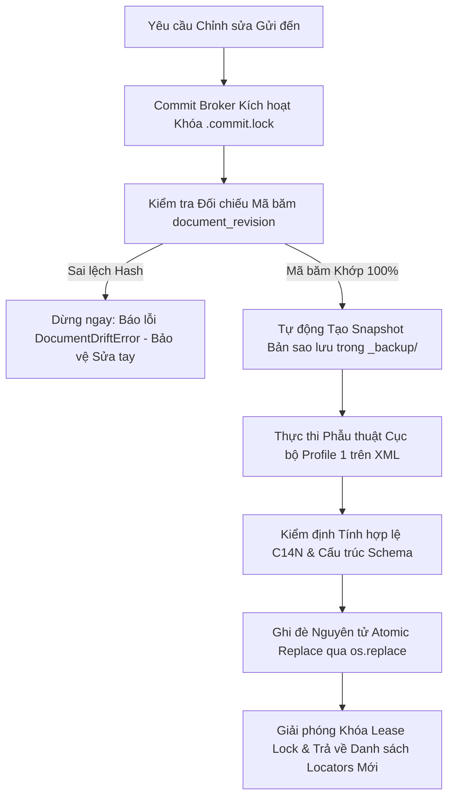

# Word Tools (Docx Surgical Engine) 🚀

> **Hạ tầng phẫu thuật tài liệu Word (.docx) tại chỗ với độ chính xác cao dành cho AI Agent & Hệ thống tự động hóa.**  
> *Chỉnh sửa trực tiếp trên file Microsoft Word hiện có mà không cần tạo lại từ đầu, bảo tồn nguyên vẹn 100% nội dung sửa tay của con người, định dạng phức tạp, hình vẽ, và cấu trúc gói tệp OPC.*

[](LICENSE)
[](https://www.python.org/)
[](adapters/word_engine_client.ts)
[](#6-kiến-trúc-cốt-lõi--lưới-an-toàn-bảo-vệ-dữ-liệu)

---

## 🌟 1. Tại sao cần Word Tools?

Các công cụ sinh tài liệu Word truyền thống (hoặc các thư viện đọc rồi lưu lại toàn bộ file `.docx`) đều gặp phải một **nhược điểm chí mạng: luôn dựng lại toàn bộ file từ đầu**. Khi một AI Agent hoặc kịch bản tự động sinh lại file, nó sẽ vô tình xóa sạch:
- Toàn bộ thao tác chỉnh sửa tay của người dùng ngoài Microsoft Word (kéo chỉnh khung ảnh, căn chỉnh độ rộng cột bảng, ghi chú thủ công, giãn dòng typography).
- Các định dạng OpenXML phức tạp (bảng lồng nhau, hình khối trôi nổi floating shapes, viền chuyên dụng, khung dấu công chứng).
- Mối liên kết giữa các phần tệp OPC bên trong tài liệu.

**Word Tools** giải quyết triệt để vấn đề này bằng **Kiến trúc Phẫu thuật tại chỗ (Profile 1 - Surgical In-Place)**:
- **Tuyệt đối không dựng lại toàn bộ file:** Mở gói `.docx`, xác định chính xác vị trí XML của đúng đoạn văn hoặc ô bảng cần sửa, thực hiện thay thế cục bộ và đóng gói lại.
- **Bảo toàn ở cấp độ Byte:** Các thành phần OPC không liên quan được giữ nguyên vẹn 100% mã băm SHA-256 thô. Các cây XML con không bị chạm tới được bảo toàn nguyên vẹn 100% theo chuẩn Canonical XML (C14N).
- **Khóa lạc quan & Lưới chống mất dữ liệu (Anti-Drift Guardrail):** Mọi vị trí cần sửa đều được gắn chặt với mã băm mật mã `document_revision`. Nếu người dùng đã mở Word ra sửa tay trước đó, hệ thống sẽ phát hiện sai lệch (`DocumentDriftError`) và lập tức dừng lại, kiên quyết từ chối ghi đè để bảo vệ nội dung sửa tay.

---

## 📦 2. Bảng Tính năng & Lệnh Cốt lõi

| Lệnh CLI | Nghiệp vụ chính | Cơ chế an toàn |
| :--- | :--- | :--- |
| **`inspect`** | Quét cấu trúc tài liệu, tính mã băm phiên bản và cấp định danh ô/đoạn (`locators`). | Sinh `document_revision` và `context_sha256` độc bản. |
| **`patch-cell`** | Phẫu thuật sửa nội dung hoặc kiểu dáng của một ô bảng duy nhất. | Khóa lạc quan (Optimistic lock), giữ nguyên viền, padding và màu nền ô. |
| **`patch-text`** | Tìm và thay thế chuỗi văn bản phân tách qua nhiều run định dạng (`<w:r>`). | Giữ nguyên in đậm/nghiêng; tự động dừng an toàn khi gặp thẻ XML phức tạp. |
| **`set-geometry`** | Căn chuẩn khổ giấy A4, lề công chứng và chống tràn dòng gãy bảng (`cantSplit`). | Tách bạch độc lập giữa cơ chế Dàn trang (Pagination) và Viền bảng (Borders). |
| **`stamp-ops`** | Chèn ảnh con dấu, chữ ký điện tử vào vị trí neo toạ độ chính xác. | Kiểm tra danh sách trắng SHA-256 (Allowlist) & ghi nhật ký xuất xứ kiểm toán. |
| **`backups` & `restore`** | Quản lý lịch sử bản sao lưu tự động và khôi phục nguyên trạng an toàn. | Từ chối khôi phục nếu đĩa có chỉnh sửa tay mới hơn (`RestoreConflictError`). |

---

## 🛠️ 3. Cài đặt & Yêu cầu Môi trường

### Yêu cầu Hệ thống
- **Python**: `>= 3.10`
- **Hệ điều hành**: Hỗ trợ Windows, macOS, Linux (Tính năng xuất PDF đối chiếu hình học yêu cầu Windows có cài Microsoft Word).

### Cài đặt
```bash
git clone https://github.com/tunglamhe180046/word-tools.git
cd word-tools
pip install -r requirements.txt
```

### Các thư viện phụ thuộc chính
- `lxml`: Phân tích cú pháp XML hiệu năng cao, duyệt XPath và chuẩn hoá Canonical XML (C14N).
- `python-docx`: Đọc và trích xuất cấu trúc văn bản DOCX.
- `pillow`: Xử lý kích thước điểm ảnh cho con dấu và chữ ký.
- `psutil` & `pywin32`: Cơ chế Watchdog giám sát tiến trình và tự động hoá Word COM không giao diện (headless) trên Windows.
- `pymupdf`: Chuyển đổi PDF sang ảnh (rasterization) để đối chiếu trực quan.

---

## 💻 4. Hướng dẫn Sử dụng Giao diện Dòng lệnh (CLI)

Điểm nhập lệnh duy nhất của công cụ là `cli.py`. Mọi lệnh đều hỗ trợ tham số `--json` xuất kết quả có cấu trúc trên `stdout`, cực kỳ thuận tiện cho việc tích hợp vào AI Agent (Claude, GPT, Jarvis) hoặc pipeline tự động.

### 4.1. `inspect` — Khám phá Cấu trúc & Cấp Toạ độ (Locators)
Quét toàn bộ tài liệu để lấy mã phiên bản và danh sách định danh:
```bash
python cli.py inspect tailieu_mau.docx --json
```
**Ví dụ kết quả JSON trả về:**
```json
{
  "success": true,
  "outcome": "inspected",
  "document_revision": "sha256:d8a2f1b4...",
  "locators": [
    {
      "object_id": "cell_t0_r1_c2",
      "kind": "table_cell",
      "table_index": 0,
      "row_index": 1,
      "col_index": 2,
      "structural_path": "/w:document/w:body/w:tbl[1]/w:tr[2]/w:tc[3]",
      "expected_text": "8.5",
      "context_sha256": "sha256:c9e1..."
    }
  ]
}
```

### 4.2. `patch-cell` — Sửa Phẫu thuật Ô Bảng
Thay đổi điểm số hoặc nội dung ô bảng kèm kiểm tra xung đột:
```bash
python cli.py patch-cell tailieu_mau.docx \
  --target-id "cell_t0_r1_c2" \
  --new-text "9.0" \
  --expected-revision "sha256:d8a2f1b4..." \
  --json
```

### 4.3. `patch-text` — Thay thế Văn bản Đa-Run (Multi-Run Resolver)
Trong Word, một từ hoặc cụm từ thường bị phân mảnh thành nhiều thẻ `<w:r>` do lịch sử gõ hoặc kiểm tra chính tả. Lệnh `patch-text` ghép nối mượt mà và thay thế chính xác:
```bash
python cli.py patch-text tailieu_mau.docx \
  --search "Tên Tổ Chức Cũ" \
  --replace "Tên Tổ Chức Mới" \
  --json
```
* **Chuẩn hoá Unicode:** Tự động chuẩn hoá Unicode NFC cho cả chuỗi tìm kiếm và chuỗi thay thế.
* **Nguyên tắc Fail-closed:** Lập tức dừng và báo lỗi an toàn nếu đoạn văn bản cần thay thế nằm đè lên các thẻ XML phức tạp (siêu liên kết hyperlink, hình vẽ drawing, theo dõi sửa đổi tracked changes).

### 4.4. `set-geometry` — Chuẩn hoá Khổ giấy, Lề & Bảng Biểu
Căn chỉnh khổ giấy A4, áp dụng lề chuẩn công chứng và chống tràn dòng gãy bảng:
```bash
python cli.py set-geometry tailieu_mau.docx \
  --page-size A4 \
  --margins notary \
  --pagination \
  --borders notary-standard \
  --json
```

### 4.5. `stamp-ops` — Chèn Con Dấu & Chữ Ký Pháp Lý
Chèn ảnh con dấu vào đúng đoạn văn chỉ định với kiểm tra an ninh mật mã:
```bash
python cli.py stamp-ops tailieu_mau.docx \
  --asset-path assets/dau_do_phong_ho_so.png \
  --target-id "para_5" \
  --width-mm 35 \
  --height-mm 35 \
  --json
```

### 4.6. `backups` & `restore` — Sao lưu & Khôi phục An toàn
```bash
# Xem danh sách các bản đã sao lưu tự động
python cli.py backups tailieu_mau.docx --json

# Khôi phục về bản sao lưu trước đó
python cli.py restore tailieu_mau.docx \
  --backup-id "<id_ban_sao_luu>" \
  --json
```

---

## ⚡ 5. Tích hợp với TypeScript / Node.js

Bộ công cụ cung cấp sẵn một Client Adapter bất đồng bộ viết bằng TypeScript tại đường dẫn `adapters/word_engine_client.ts`:

```typescript
import {
  inspectDocument,
  patchCell,
  patchText,
  setGeometry
} from "./adapters/word_engine_client";

async function run() {
  const docPath = "tailieu_mau.docx";

  // 1. Quét tài liệu để lấy phiên bản hiện hành
  const inspection = await inspectDocument(docPath);
  console.log("Mã phiên bản hiện tại:", inspection.document_revision);

  // 2. Tìm ô cần sửa và thực hiện phẫu thuật tại chỗ
  const target = inspection.locators.find(loc => loc.expected_text === "8.5");
  if (target) {
    const result = await patchCell(docPath, {
      targetId: target.object_id,
      newText: "9.0",
      expectedRevision: inspection.document_revision,
    });
    console.log("Mã phiên bản mới sau khi sửa:", result.new_document_revision);
  }

  // 3. Thay thế chuỗi văn bản giữ nguyên định dạng in đậm/nghiêng
  await patchText(docPath, {
    search: "BẢN THẢO",
    replace: "BẢN CHÍNH THỨC",
  });
}

run().catch(console.error);
```

---

## 🛡️ 6. Kiến trúc Cốt lõi & Lưới An toàn Bảo vệ Dữ liệu



1. **Độc lập Tuyệt đối (Zero Cross-Dependencies):** Module hoạt động độc lập 100%, không phụ thuộc vào bất kỳ logic nghiệp vụ hoặc framework bên ngoài nào.
2. **Chế độ Phẫu thuật Profile 1:** Giữ nguyên vẹn từng byte của các thành phần XML và OPC part không nằm trong diện cần sửa đổi.
3. **Commit Broker 18 Bước:** Mọi thao tác ghi đĩa đều đi qua khóa loại trừ tương hỗ (`.commit.lock`), tạo backup tự động có timestamp, và ghi đè nguyên tử (`os.replace`).
4. **Nguyên tắc Fail-closed Tuyệt đối:** Nếu phát hiện file có người sửa ngoài Word sau thời điểm quét, hệ thống lập tức từ chối ghi đè để bảo vệ an toàn công sức của người dùng.

---

## 🧪 7. Kiểm thử Tự động (Testing)

Word Tools đi kèm bộ kiểm thử toàn diện từ đơn vị (unit test) đến tích hợp (integration test):

```bash
# Chạy toàn bộ 123 bài kiểm thử với pytest
pytest tests/ -v
```

---

## 📄 8. Bản quyền & Giấy phép

Dự án được phát hành theo giấy phép nguồn mở [MIT License](LICENSE) — Bản quyền (c) 2026 Tùng Lâm.
