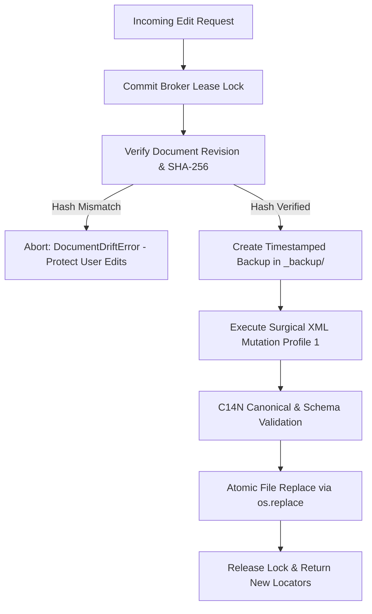

# Word Tools (Docx Surgical Engine) 🚀

> **High-Precision, Surgical In-Place DOCX Manipulation Engine for AI Agents & Automation Pipelines.**  
> *Edit existing Microsoft Word (.docx) files without regenerating from scratch, preserving 100% of human manual edits, complex formatting, drawings, and OPC package integrity.*

[](LICENSE)
[](https://www.python.org/)
[](adapters/word_engine_client.ts)
[](#core-architecture--invariants)

---

## 🌟 Why Word Tools?

Traditional Word document generators (or libraries that reload and rewrite entire `.docx` archives) suffer from a major fatal flaw: **they regenerate the entire document**. When an AI agent or automated script rewrites a document, it wipes out:
- Manual user tweaks (dragged image boxes, fine-tuned table widths, manual comments, custom font kerning).
- Complex OpenXML features (nested drawings, floating shapes, complex borders, notary stamps).
- Unrelated document sections and OPC relationships.

**Word Tools** solves this with a **Surgical In-Place Architecture (Profile 1)**:
- **Zero Document Regeneration:** It opens the `.docx` archive, performs surgical XML DOM mutations on **only the targeted paragraph or cell**, and repacks it.
- **Byte-level Preservation:** Untouched OPC parts retain their exact raw SHA-256 hash. Untouched XML subtrees retain 100% C14N canonical equivalence.
- **Optimistic Concurrency & Anti-Drift Guardrail:** Every target locator is bound to a cryptographic `document_revision`. If a human user has edited the file in Word in the meantime, the engine refuses to overwrite (`DocumentDriftError`), preventing silent data loss.

---

## 📦 Key Capabilities

| Command | Purpose | Safety Features |
| :--- | :--- | :--- |
| **`inspect`** | Scans document structure, hashes revisions, and generates stable object locators. | Cryptographic `document_revision` & `context_sha256`. |
| **`patch-cell`** | Surgically edits a specific table cell's text or styling. | Optimistic locking, preserves cell borders & shading. |
| **`patch-text`** | Replaces text across arbitrary run boundaries (`<w:r>`). | Preserves bold/italic styles; fails closed on complex XML spans. |
| **`set-geometry`** | Sets page size (A4), margins, and enforces pagination safety (`cantSplit`). | Independent separation of pagination and border styling. |
| **`stamp-ops`** | Inserts stamps, seals, and signatures at exact anchors. | SHA-256 asset allowlist verification & audit provenance ledger. |
| **`backups` & `restore`** | Manages automatic snapshots and atomic rollback transactions. | Prevents restoring over newer manual edits (`RestoreConflictError`). |

---

## 🛠️ Installation & Requirements

### System Requirements
- **Python**: `>= 3.10`
- **Operating System**: Windows, macOS, or Linux (Windows required for headless Word COM visual verification).

### Setup
```bash
git clone https://github.com/tunglamhe180046/word-tools.git
cd word-tools
pip install -r requirements.txt
```

### Core Dependencies
- `lxml`: High-performance XML parsing, XPath traversal, and C14N canonicalization.
- `python-docx`: DOCX structure inspection and manipulation.
- `pillow`: Image processing for stamp and seal dimensions.
- `psutil` & `pywin32`: Windows watchdog monitoring and headless Word COM automation.
- `pymupdf`: PDF rasterization and visual regression verification.

---

## 💻 CLI Usage Guide

The primary entry point is `cli.py`. All commands support `--json` output, making it ideal for integration with AI Agents (Claude, GPT, Jarvis) or automated CI/CD pipelines.

### 1. `inspect` — Document Discovery & Locator Generation
Scan any document to generate stable structural IDs:
```bash
python cli.py inspect sample.docx --json
```
**Sample JSON Output:**
```json
{
  "success": true,
  "outcome": "inspected",
  "document_revision": "sha256:d8a2f1b4...",
  "locators": [
    {
      "object_id": "cell_t0_r1_c2",
      "kind": "table_cell",
      "table_index": 0,
      "row_index": 1,
      "col_index": 2,
      "structural_path": "/w:document/w:body/w:tbl[1]/w:tr[2]/w:tc[3]",
      "expected_text": "8.5",
      "context_sha256": "sha256:c9e1..."
    }
  ]
}
```

### 2. `patch-cell` — Precision Table Cell Editing
Modify a table cell with concurrency verification:
```bash
python cli.py patch-cell sample.docx \
  --target-id "cell_t0_r1_c2" \
  --new-text "9.0" \
  --expected-revision "sha256:d8a2f1b4..." \
  --json
```

### 3. `patch-text` — Multi-Run Search & Replace
Word often fragments words across multiple XML runs due to spellcheck or formatting. `patch-text` seamlessly stitches runs together:
```bash
python cli.py patch-text sample.docx \
  --search "Old Organization Name" \
  --replace "New Organization Name" \
  --json
```
* **Unicode Normalization:** Automatically standardizes Unicode NFC across search terms.
* **Fail-Closed Safety:** Refuses mutation if the target string spans unsupported complex XML elements (e.g. hyperlinks, drawing objects, tracked changes).

### 4. `set-geometry` — Standardizing Geometry & Pagination
Enforce A4 standards, notary margins, and prevent awkward page breaks across tables:
```bash
python cli.py set-geometry sample.docx \
  --page-size A4 \
  --margins notary \
  --pagination \
  --borders notary-standard \
  --json
```

### 5. `stamp-ops` — Digital Stamp & Signature Ingestion
Inject official stamps with cryptographic security checks:
```bash
python cli.py stamp-ops sample.docx \
  --asset-path assets/official_stamp.png \
  --target-id "para_5" \
  --width-mm 35 \
  --height-mm 35 \
  --json
```

---

## ⚡ TypeScript / Node.js Integration

Word Tools provides an asynchronous TypeScript adapter client at `adapters/word_engine_client.ts`:

```typescript
import {
  inspectDocument,
  patchCell,
  patchText,
  setGeometry
} from "./adapters/word_engine_client";

async function main() {
  const docPath = "sample.docx";

  // 1. Inspect document structure
  const inspection = await inspectDocument(docPath);
  console.log("Current Revision:", inspection.document_revision);

  // 2. Find and surgically patch a cell
  const target = inspection.locators.find(loc => loc.expected_text === "8.5");
  if (target) {
    const result = await patchCell(docPath, {
      targetId: target.object_id,
      newText: "9.0",
      expectedRevision: inspection.document_revision,
    });
    console.log("Updated Revision:", result.new_document_revision);
  }

  // 3. Global text replacement preserving styles
  await patchText(docPath, {
    search: "DRAFT",
    replace: "OFFICIAL RELEASE",
  });
}

main().catch(console.error);
```

---

## 🛡️ Core Architecture & Invariants



1. **Zero Cross-Dependencies:** Completely self-contained engine. Does not import external business or framework logic.
2. **Profile 1 Surgical Mode:** Unaffected XML subtrees and OPC parts remain 100% byte-identical.
3. **18-Step Commit Broker:** Every write operation is wrapped in a mutual-exclusion commit lease (`.commit.lock`), automatic snapshotting, and atomic replacement.
4. **Data Loss Guardrail:** Strictly fail-closed. If an external user modified the file outside the engine, operations abort immediately to protect manual work.

---

## 🧪 Running Tests

Word Tools comes with an extensive unit and integration test suite:

```bash
# Run full pytest suite
pytest tests/ -v
```

---

## 📄 License

This project is licensed under the [MIT License](LICENSE).
